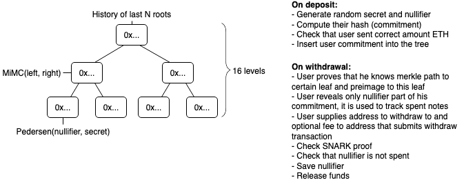
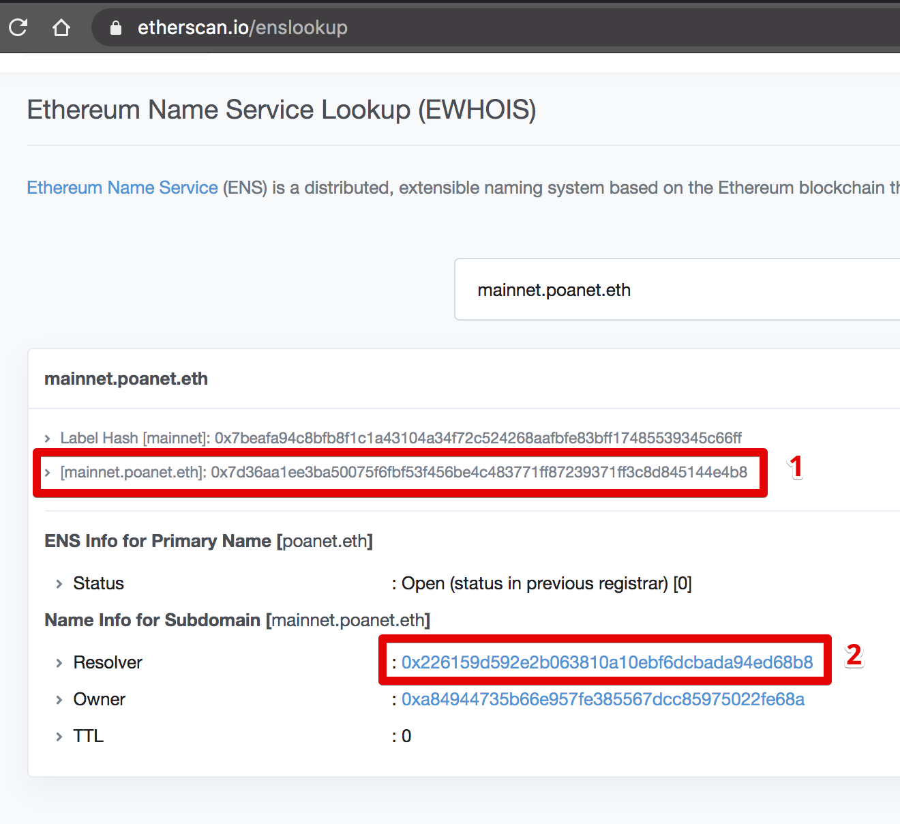
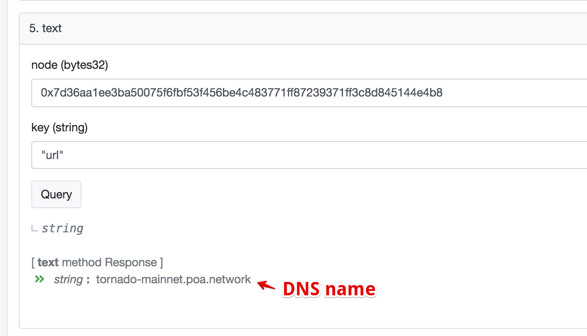

### 编译circuits
```
yarn build:circuit
```

编辑`/circuits/withdraw.circom`的最后一行：

```
component main = Withdraw(14);
```

可以调整`Merkle树`的层数。层数越高，GAS费越高

编译完成后，在`/build/`目录下，会产生`circuits`目录，将此目录完整的复制到`shaker`前端的`/public`目录下。

另外，将`circuits`目录下的`withdraw.json`文件复制到前端`/src/circuits/`目录下。

### 部署合约
合约源文件：`/contracts`目录下。

部署时，用的账户是.env文件中的私钥对应账户。

部署合约前，需要设置`.env`文件中的`ERC20_TOKEN`，即`USDT`合约地址。并确保`MERKLE_TREE_HEIGHT`默克尔树的高度和编译`circuit`时的一致。

根据不同的以太坊网络，采用不同的合约部署命令：

```
yarn migrate:dev //本地开发网络
yarn migrate:kovan
yarn migrate:rinkeby
yarn migrate:mainnet
```
如果全新部署，在上面命令行后加`--reset`。如果部署过程中出现错误，则把`--reset`去掉，再次执行。

部署完成后，将`ERC20Shaker`合约地址复制到`shaker`前端`/client/config.js` 中的`ERC20ShakerAddress` 中；将`ETHShaker`合约地址复制到`config.js`的`ETHShakerAddress`中。

另外，将合约ABI文件`ERC20Shaker.json`和`ETHShaker.json`复制到`shaker`前端的`/src/contracts`目录中。

还要将合约ABI文件中内容，复制到`Relayer`的`mixerABI.json`中。

### 测试合约命令
#### Deposit
```
./cli.js test
```

#### Withdraw
```
./cli.js withdraw shaker-usdt-5-2000-0x8338941878995cc0c5df9aaa1e4d5307c2d41a678aade05dce3ad8b3858dacea19e4ecbb3fb24b9ae3bc62ad831ac034350108321fe5c2e809471c8803d9 0xC804C9bFAe7Da9C4C409120773d0B4107cfACBBF 1 --rpc https://kovan.infura.io/v3/0279e3bdf3ee49d0b547c643c2ef78ef
```

#### 查询存单
```
./cli.js compliance shaker-usdt-5-2000-0x4aa1a3848578f716c6dce7e358e6bcdfbcb8e3e3ec1944ba8d45083d77e7f014acb4618ab51e7cbf19bec092abe87153e45209a2a01e76e63af797adfd70
```

# Tornado Cash Privacy Solution [](https://travis-ci.org/tornadocash/tornado-core)

Tornado Cash is a non-custodial Ethereum and ERC20 privacy solution based on zkSNARKs. It improves transaction privacy by breaking the on-chain link between recipient and destination addresses. It uses a smart contract that accepts ETH deposits that can be withdrawn by a different address. Whenever ETH is withdrawn by the new address, there is no way to link the withdrawal to the deposit, ensuring complete privacy.

To make a deposit user generates a secret and sends its hash (called a commitment) along with the deposit amount to the Tornado smart contract. The contract accepts the deposit and adds the commitment to its list of deposits.

Later, the user decides to make a withdrawal. In order to do that, the user should provide a proof that he or she possesses a secret to an unspent commitment from the smart contract’s list of deposits. zkSnark technology allows that to happen without revealing which exact deposit corresponds to this secret. The smart contract will check the proof, and transfer deposited funds to the address specified for withdrawal. An external observer will be unable to determine which deposit this withdrawal came from.

You can read more about it in [this medium article](https://medium.com/@tornado.cash/introducing-private-transactions-on-ethereum-now-42ee915babe0)

## Specs
- Deposit gas const: 1088354 (43381 + 50859 * tree_depth)
- Withdraw gas cost: 301233
- Circuit Constraints = 28271 (1869 + 1325 * tree_depth)
- Circuit Proof time = 10213ms (1071 + 347 * tree_depth)
- Serverless



## Whitepaper
**[https://tornado.cash/Tornado.cash_whitepaper_v1.4.pdf](https://tornado.cash/Tornado.cash_whitepaper_v1.4.pdf)**

## Was it audited?

Tornado.cash protocols, circuits, and smart contracts were audited by a group of experts from [ABDK Consulting](https://www.abdk.consulting), specializing in zero knowledge, cryptography, and smart contracts.

During the audit no critical issues were found and all outstanding issues were fixed. The results can be found here:

* Cryptographic review https://tornado.cash/Tornado_cryptographic_review.pdf
* Smart contract audit https://tornado.cash/Tornado_solidity_audit.pdf
* Zk-SNARK circuits audit https://tornado.cash/Tornado_circuit_audit.pdf

Underlying circomlib dependency is currently being audited, and the team already published most of the fixes for found issues

## Requirements
1. `node v11.15.0`
2. `npm install -g npx`

## Usage

You can see example usage in cli.js, it works both in console and in browser.

1. `npm install`
1. `cp .env.example .env`
1. `npm run build` - this may take 10 minutes or more
1. `npx ganache-cli`
1. `npm run test` - optionally runs tests. It may fail on the first try, just run it again.

Use browser version on Kovan:

1. `vi .env` - add your Kovan private key to deploy contracts
1. `npm run migrate`
1. `npx http-server` - serve current dir, you can use any other static http server
1. Open `localhost:8080`

Use with command line version. Works for Ganache, Kovan and Mainnet:
### Initialization
1. `cp .env.example .env`
1. `npm run download`
1. `npm run build:contract`

### Ganache
1. make sure you complete steps from Initialization
1. `ganache-cli -i 1337`
1. `npm run migrate:dev`
1. `./cli.js test`
1. `./cli.js --help`

### Kovan, Mainnet
1. make sure you complete steps from Initialization
1. Add `PRIVATE_KEY` to `.env` file
1. `./cli.js --help`

Example:
```bash
./cli.js deposit ETH 0.1 --rpc https://kovan.infura.io/v3/27a9649f826b4e31a83e07ae09a87448
```
> Your note: tornado-eth-0.1-42-0xf73dd6833ccbcc046c44228c8e2aa312bf49e08389dadc7c65e6a73239867b7ef49c705c4db227e2fadd8489a494b6880bdcb6016047e019d1abec1c7652
> Tornado ETH balance is 8.9
> Sender account ETH balance is 1004873.470619891361352542
> Submitting deposit transaction
> Tornado ETH balance is 9
> Sender account ETH balance is 1004873.361652048361352542

```bash
./cli.js withdraw tornado-eth-0.1-42-0xf73dd6833ccbcc046c44228c8e2aa312bf49e08389dadc7c65e6a73239867b7ef49c705c4db227e2fadd8489a494b6880bdcb6016047e019d1abec1c7652 0x8589427373D6D84E98730D7795D8f6f8731FDA16 --rpc https://kovan.infura.io/v3/27a9649f826b4e31a83e07ae09a87448 --relayer https://kovan-frelay.duckdns.org
```

> Relay address:  0x6A31736e7490AbE5D5676be059DFf064AB4aC754
> Getting current state from tornado contract
> Generating SNARK proof
> Proof time: 9117.051ms
> Sending withdraw transaction through relay
> Transaction submitted through the relay. View transaction on etherscan https://kovan.etherscan.io/tx/0xcb21ae8cad723818c6bc7273e83e00c8393fcdbe74802ce5d562acad691a2a7b
> Transaction mined in block 17036120
> Done

## Deploy ETH Tornado Cash
1. `cp .env.example .env`
1. Tune all necessary params
1. `npx truffle migrate --network kovan --reset --f 2 --to 4`

## Deploy ERC20 Tornado Cash
1. `cp .env.example .env`
1. Tune all necessary params
1. `npx truffle migrate --network kovan --reset --f 2 --to 3`
1. `npx truffle migrate --network kovan --reset --f 5`

**Note**. If you want to reuse the same verifier for all the instances, then after you deployed one of the instances you should only run 4th or 5th migration for ETH or ERC20 contracts respectively (`--f 4 --to 4` or `--f 5`).

## How to resolve ENS name to DNS name for a relayer
1. Visit https://etherscan.io/enslookup and put relayer ENS name to the form.
2. Copy the namehash (1) and click on the `Resolver` link (2)

3. Go to `Contract` tab. Click on `Read Contract` and scrolldown to the `5. text` method.
4. Put the values:

5. Click `Query` and you will get the DNS name. Just add `https://` to it and use it as `relayer url`

## Credits

Special thanks to @barryWhiteHat and @kobigurk for valuable input,
and to @jbaylina for awesome [Circom](https://github.com/iden3/circom) & [Websnark](https://github.com/iden3/websnark) framework

## Minimal demo example
1. `npm i`
1. `ganache-cli -d`
1. `npm run download`
1. `npm run build:contract`
1. `cp .env.example .env`
1. `npm run migrate:dev`
1. `node minimal-demo.js`

## Emulate MPC trusted setup ceremony
```bash
cargo install zkutil
npx circom circuits/withdraw.circom -o build/circuits/withdraw.json
zkutil setup -c build/circuits/withdraw.json -p build/circuits/withdraw.params
zkutil export-keys -c build/circuits/withdraw.json -p build/circuits/withdraw.params -r build/circuits/withdraw_proving_key.json -v build/circuits/withdraw_verification_key.json
zkutil generate-verifier -p build/circuits/withdraw.params -v build/circuits/Verifier.sol
sed -i -e 's/pragma solidity \^0.6.0/pragma solidity 0.5.17/g' ./build/circuits/Verifier.sol
```
